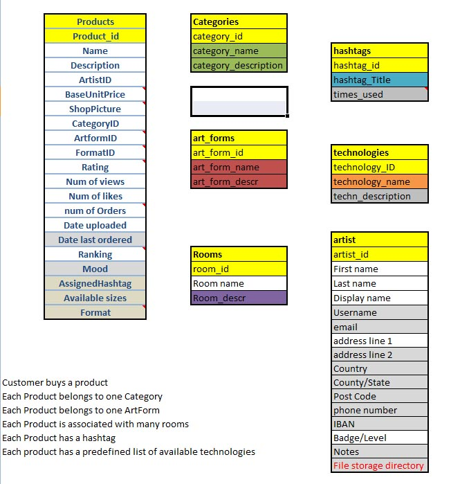
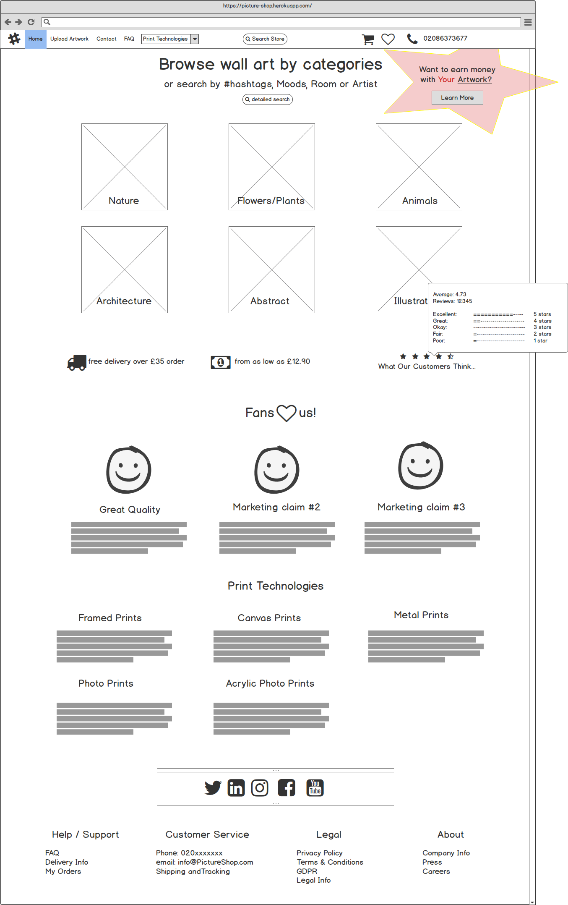
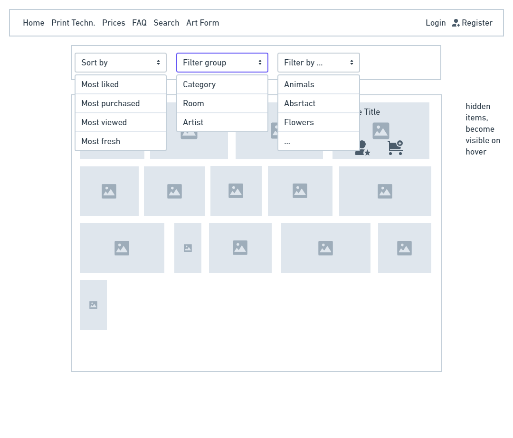
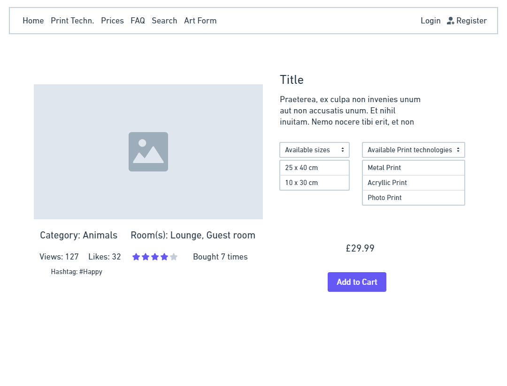
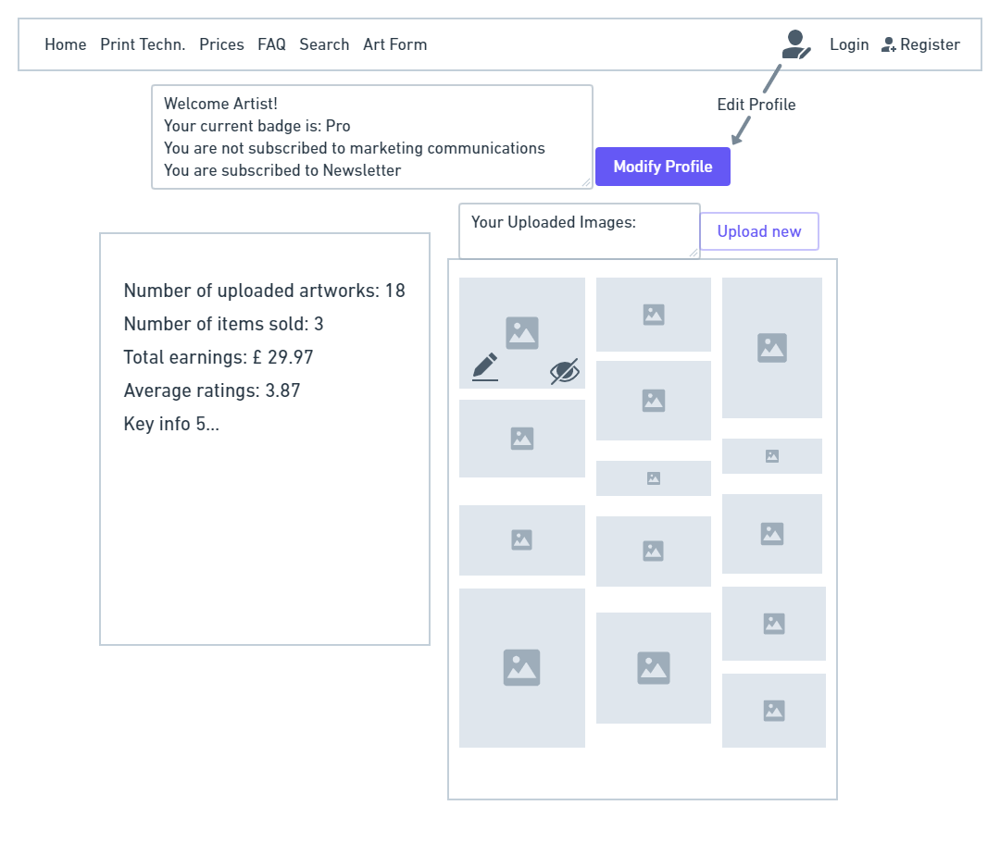

# Pictures on the Wall

[](https://travis-ci.org/Sarosim/pictures-on-the-wall)

# Full Stack Frameworks Milestone Project @ Code Institute

## Project purpose

To build a full-stack site based around business logic used to control a centrally-owned dataset, including 
authentication mechanism and provide paid access to the products/services. 

[Link to the live app on Heroku](https://picture-shop.herokuapp.com/)

## My aims with the project

- My primary aim was to build a Django app with extended features so that I can learn and practice Python 
and Django and experiment around the capabilities. 
- Also, I wanted to build a visually appealing site that is eye catching and can potentially attract users.
- I have also put efforts into the business logic, so it can become a viable product.

## Value provided:
1.  By authenticating on the site and paying for some of its services, users can advance their own goals. 
Before authenticating, the site makes it clear how those goals would be furthered by the site.
2.  The site owner is able to make money by providing this set of services to the users. There is no way for 
a regular user to bypass the site's mechanisms and derive all of the value available to paid users without paying.

## My Project idea - Pictures on the Wall

A web shop for ordering prints from stock photos primarily for decorational purposes for homes, with a slogan: 
Decorate your home, office or garden shed with these amazing photos printed to your taste and in the size you want. 
Photographers can upload their photos and get paid after each print. Site owner can make money on orders of 
other users’ images as well as upload their own work and earn money on each print ordered. Printing would be 
done by a contracted service provider. As the business grows, own printing facility may be considered.

### External user’s goal:

#### End users (buyers):
Purchase amazing photo prints for decorating homes, offices or their business premises (hotel rooms, etc...)

#### Hobby photographers:
Start making money. Photographers who don’t have their own website for selling their images (mostly hobby 
photographers or pros early in their career) can start earning some money by uploading their artwork and presenting it to potential buyers.

### Site owner’s goal may include:

Make money with their own images 
Utilize the site for providing opportunity to other photographers. 
This way potentially gaining critical mass earlier. Also, bigger the selection, better the user experience.

# UX

## Strategy

Present a visually appealing site with photos and artwork for purchasing as home decor – printed on various surfaces and in various sizes.
Let users scroll images, filter by genre, or search by hashtag. Option for browsing images of selected artist.
Primary target audience is people planning to decorate their home / office / garden shed :) 
Secondary target audience is photographers and fine artists trying to make money with their artwork

## Scope

### To be included in the first production release:
- Landing page with eye-catchy intro
- Mass-displaying all or filtered artwork. Lines of relatively small images, with option to click and view or like. 
- Search, filter and sort artwork.
- Detailed profile for artists on top of the simple registration.
- Dedicated page for uploading artwork
- Dashboard for artists, to overview their activity.
- Necessary cart manipulation.
- Checkout with card payment. 
- Artwork full page view to include: Artist, Title, description, size options, print type (canvas, acrylic, 
photo, etc...), quantity, rating, number of likes, views and purchases, category, suggested rooms, hashtag.

### What's out of scope?
- Order processing after checkout is excluded; the last step of the process is the payment.
- In order to be viable this kind of service should include visually presenting different printing technologies, but is not included in this project.
- Potential further features:
    - Coupon code for promotions,
    - Discount for multi-buys. 

- Marketing the site itself and utilising advertising opportunities within the site is out of scope, therefore no links to social 
media sites 
- Legal framework is also excluded, no links to contacts or T&Cs delivery terms, corporate info website.

## Structure 

### Page structure

#### Home page

There are two types of users and I wanted to give clear path to start using the site with Call To Action 
for both groups. Potential buyers are directed to the Category (or other) browsing, while potential 
contributors are shown an eye-catchy banner with a popping CTA button.

#### Filtering and browsing 
are on the top of the landing page, first thing buyers can see. Many similar sites (competitors, let’s say) 
are trying to showcase wide range of services and options, therefore loosing focus and probably 
loosing potential buyers by not inspiring them to further explore the site. My clear 
goal here is to lead users to check out artworks (photos or paintings reproductions).

#### Most likely next step 
of the user is visiting the products page, where all or filtered artworks are presented. 
I wanted to present relatively small images, to let them see an abundance of options. 
Therefore the information and potential actions are limited on this view: 
- title of the artwork,
- option to like artwork (with number of likes showing up only on hover)
- add to cart (without specifications, e.g. size, quantity)
Search and sorting options are also available on this site. In a later release, 
filtering options will also be available on this page, currently only provided on the home page.

#### Detailed view
Clicking on any of the artworks on the products page brings the user to the product details page,
displaying all the available information about each artwork. Besides the information, this is the place 
where users can select from the available sizes and printing technologies as well as provide 
desired quantity. Quantity is less of an importance in our case than for other web-shops, as 
normally people will order one copy of a picture they want to hang on their wall. Only commercial 
buyers (e.g. hotels) will go for multiple copies of the same image.

#### Potential contributors
Potential contributors have a flow of action to fully utilize the page and achieve their goals.
They have a strictly limited access to the part of the database that concerns their artwork and 
therefore can perform CRUD operations

1. **C**reate new entry: upload image and provide details
2. **R**ead (Display) entries - the detailed view and a dashboard with personal information
3. **U**pdate entries - making changes to their existing records
4. **D**elete entries – delete items from the database (for the sake of simplicity they actually
 delete from the database, but in a later release it may be turned into a sort of hibernation, 
 to keep and continue to show historical data on their dashboard)

### Database structure and schema:
According to the advice of Ali AShik, my mentor at the time of the early stages of the project, 
I put quite some effort into designing the database structure and schema. It was a difficult activity 
for me as I have never really done this before (the schema for my previous Flask based project with 
Code Institute was rather very simple). 

I used https://www.guru99.com/er-diagram-tutorial-dbms.html to guide me through the Entity Relationship Model design.

The steps and outcome was as follows (note that the final structure differs at several points, 
because I had to adjust on multiple occasions):
#### 1st step, identify entities:
- User (there are two types, but instead of handling them as separate entities, will have Boolean 
attributes for customer and contributor, as one user can belong to both groups)
- Artwork (the image and all details)
- Artwork type (photo, painting, reproduction from painting, graphic)
- Artwork Category (each artwork is assigned to one group, e.g. ‘nature’, or ‘still’ or ‘architecture’)
- Print technologies
- Hashtags
- Sizes
- Prices ? not sure if it has to be an entity...

#### 2nd step, identify relationships:



#### DATABASE:

Products, in my case Artwork, but let’s call it product, more understandable for other developers.
Attributes: 
- Name
- Description
- Artist
- Base Reproduction Fee (practically this is the base price of the product – can vary based on quality, owner can set it)
- Image
- Category
- ArtformID (photography, fine art [painting, graphic]) – LEFT OUT IN PRODUCTION VERSION
- Available sizes? maybe max print size
- Available technologies
- Format (aspect ratio) 
- Rating (5 star scale) – should contain each individual rating as a dictionatry  display 
average stars or each star category with number of ratings in there 
- Number of times it’s been ordered
- Number of views
- Date uploaded

Categories
- Nature
- Animals
- Flowers / Plants
- Architecture
- Music 
- Vehicles
- Food & Drinks
- Paintings
- Abstract

Formats:
- 3:2 – aspect ratio = 1.5
- 4:3 – aspect ratio = 1.333
- Square – aspect ratio = 1
- 5:4 – aspect ratio = 1.25
- 16:9 – aspect ratio = 1.777
- Panorama – aspect ratio >= 2
- ISO – aspect ratio = 1.414

Products ratings:
- id
- productId
- rating
- date (if needed)
- ip (if needed, e.g. to prevent double rating) or userid (of the rater)

Products Moods - LEFT OUT IN PRODUCTION VERSION
- productId
- moodID

Product Hashtags
- productId
- #ID

Print technologies:
- Acrylic Print
- Metal Print
- Framed Print
- Canvas Print
- Photo Print

Artists:
- Name
- Address
- Profile picture (or avatar)
- Badge/Level (hobby, advanced, master) – this may determine ‘Base Price’
- Wants marketing e-mails (mailing list): True/False
- Wants newsletter: True/False

Room:
-   Kitchen
-   Bathroom
-   Bedroom
-   Lounge
-   Living Room
-   Children’s Room
-   Office

I created a table for ratings and product_id, so all ratings are kept in one separate 
table, but I didn’t create this kind of table for room_type and product, so I can see the 
difference in handling it later in execution. With hashtags I went for the separate table, 
as I felt that is the correct way. Later I simplified hashtags, by adding it to the Product 
model and limiting to just one hashtag per image.

## Skeleton

### Wireframe sketches:

For learning, exploring and comparison purposes I used two wireframe tools: Balsamiq and Whimsical. 
(I’ve found Whimsical easier to use and therefore faster, Balsamiq may be more versatile and can be
 a better option if one needs approval of client, Product owner or any other stakeholder.

#### Landing Page:  


#### Landing page after the intro:  



#### Products Page:



#### Product Details Page:



#### Dashboard



### Details of the landing page:

I’ve made some research into killer landing pages. This is what I come up with (some points are 
left out to leave more time to actual development...)

Landing Page Polaroid:

1.  Killer Headline
Interest, attention, and understanding. It’s what compels a visitor to stay and learn more about what you’re offering
Pictures on Your Wall
2.  Persuasive Subheads
    The home of your amazing wall decor prints for your home | office | garden shed ... from just £9.99
3.  Pictures
It is essential that the landing page contains image(s) of the product(s).
4.  An Explanation
The landing page needs to make what you’re offering perfectly clear.
5.  Pain relief
6.  Pleasure seeking humans
7.  Methods of Contact
Footer with social media and other contact details
8.  A Guarantee
100% money back guaranty – no questions asked.
9.  A Powerful call to Action 
Make it big. Generally speaking, the bigger, the better. Use a button. People have been trained 
to expect the CTA to be a button. Do not attempt to force back years of expectation by using something 
other than a button. Stick with the tried and true. People know what to do when they see a button.
Use a contrasting colour. 
Bonus points if you can incorporate graphics that draw the eye to your CTA!

The Landing page shows 6 main categories with the Polaroid stack to grid intro. After user 
scrolled/advanced from the first view, the categories show up, acting as buttons. Clicking on 
a selected category displays the pictures in that category.

## Surface

In order to be able to focus on the primary aim of the project I decided to use Bootstrap with a 
theme that has an appropriate artistic look and adjust where and if needed. 

LUX selected from Bootswatch.

## User stories

### Potential customers
- I’ve just moved house and would like to have something stunning on the wall of our bedroom... I think something cozy above the bed would be nice.
- My reception room is so dull and boring, I want to shake it up with a colourful poster on the wall, what can I get? 
- I need something nice to hang on my kitchen wall but I’d like to support some hobby artist rather than one of the giants...
- I’d like to see the different printing options available with the selected image (extra feature)
- I’d like to choose a picture for my garden shed based on mood (hashtags)
- I’d like to easily browse artwork and once selected, buy it simply without being bombarded with other items.
- I’m happy to give feedback about my purchase.
- I’m happy to rate artwork to help others find the best ones.

### Potential contributor
As a hobby photographer, my pictures hang all over the walls in my house. My friends say I should try to 
sell them, they’re so good. I’ll upload it here and will see if anyone buys them.

### Site owner
- I’d like to make some money with my photos, but I don’t have enough of them for a full web shop, let’s see 
if anyone wants to join me and offer their artwork for sale.
- I’d like to support the potential buyers with artwork rating, so each registered user can rate artwork on a 1-5 scale (stars)
- I need an eye-catching landing page that offers browsing of images in categories as the primary 
option as well as explains the site’s purpose in one sentence – a header. 

The eye-catching part being the “Polaroid stack to grid” intro, therefore practically there are two landing pages:
  - The initial state with the phone and the polaroids
  - The category grid

The 1st should have a header about the site purpose, while the 2nd offers the categories and 
links to details (description for those who want to contribute and those who want to buy)

# Design

## The final design of the key pages:
Even though the design is responsive, because of the obvious reasons, a service like this is 
less likely to be used on small mobile devices. Therefore only desktop versions of the different design elements are shown here:    

### Home page:
    - missing image
#### Products page:
    - missing image
#### Details page
    - missing image
#### Dashboard
    - missing image
    
# Features

When planning the features I was already trying to plan execution. I started where 
the user arrives - the landing page and then followed the logical path of the user. 

## Customer:

Arriving on the landing page where there is a short claim what the site is for and the 
Polaroid stack to grid with the categories. On scroll, the categories expand to grid, and 
all categories are displayed, each serving as a link to their search view. User can browse 
pictures, filter hashtags, moods, [also room type (kitchen, bathroom, bedroom, office, shed,
 etc...) if feasible easily]. 

On the page showing multiple images, user can click on a selected image: detailed info page 
of the chosen image is displayed (user story: “when something caught my attention I’d like to check the details”). 
Information to be included: bigger image, available sizes, available printing method/type, detailed description, 
delivery options and price. 

They can add it to shopping cart and place an order with the selected specifications 
(size, printing method, delivery option, ...). (user story: “I simply want to go to checkout, select quantity and pay”).
For basic functionality, there is no need to be registered. These include all searching filtering, 
browsing as well as ‘liking’ pictures and adding products to cart. Users need to be signed in to access rest of the 
features though: checkout, rating pictures and becoming a contributor with an Artist Profile and upload photos. 

Regarding print type, there should be a link from the product details page to the description of 
the selected print type. Also it should be available from navbar.

## Contributor:

Want to contribute? Link, description of requirements, what are the conditions, what kind of images 
are accepted, size restrictions, pricing mechanism explained (how much money can they make).
Once they decided, they need a button to click to upload “Click here to upload” 
Form for inserting to database. 
If signed in, okay, else: please sing in. If not registered: please create profile.
Contributor will want to have a dashboard with information about number and value of orders made 
of his artwork, number of views, ratings (how many and what rating) of his artwork.

## Price

A key feature of the site is to price the artworks based on size and print technology. Originally 
I planned pricing like this:

The owner of the picture sets a base price = Reproduction fee, the final selling price is calculated 
based on this price, plus the price of print, which comes from the printing service and is determined by print technology and size.

Selling price = base price + print price + reward artist if bigger size ordered:

Artist commission = base price + size reward (=base price x £/sqm) 

Example1 (40 x 30cm metal print):

Base price = £10

Size reward = BP x 4 x sqm = 10 x 4 x (0.3 x 0.40) = £4.8

Artist Commission = 10 + 4.8 = £14.8

Print price = £68.95

Selling price = Artist commission + print price = £83.75

Comm ratio = 17.9%

Finally the logic had to be different to be able to generate realistic prices. It is based on 
- base reproduction fee (set by the user) + some minor increase with print size
- print technology (each with a pre-determined coefficient)
- size (the diagonal of the image)

The actual calculation is done on the backend with the following process:

Upon image upload I use the Pillow Python library to find out the aspect ratio of the image and then 
save it to the Format model (a ForeignKey in the Product model) when the POST-ed form data is saved in the view. 
Each aspect ratio has its associated possible print sizes in a separate model (Size), linked to the 
product. These were generated by a utility function and are not being modified.

When the user adds a product into their cart with all the specs (print technology, size and quantity), 
unit price is calculated by the update_cart view function. These specs together with the unit price 
are added to a dictionary and is stored as the value pair of the product_id key in the session dictionary.

To be able to update prices on the detailed product template when a user selects size and technology 
I had to prepare a workaround due to the lack of my knowledge of API calls: A javaScript function 
calculates the price with event listeners on the 'select' elements for size and technology. 

This is not ideal and has its flaws, but at least the price updates on the front end...

## Checkout - payment

The checkout payment is done through Stripe Online Payment Platform. I followed the instructions of Stripe: 
Include the Stripe.js script on each page of your site — it should always be loaded directly 
from https://js.stripe.com, rather than included in a bundle or hosted yourself.
To best leverage Stripe’s advanced fraud functionality, include this script on every page, not 
just the checkout page. This allows Stripe to detect anomalous behaviour that may be indicative of fraud as customers browse your website.

# Technologies used

The main technology used for this project is [*Django*](https://www.djangoproject.com/) web framework. I used version 1.11.28

Django is a high-level Python web framework, so Python is the language used to build the back end 
functionality, creating models, accessing database, using forms.

I used [*Pillow==7.0.0*]( https://pypi.org/project/Pillow/) the Python Imaging Library to access and handle image data.

[*HTML*](https://en.wikipedia.org/wiki/HTML5), 

[*CSS*](https://en.wikipedia.org/wiki/Cascading_Style_Sheets), 

[Bootstrap](https://getbootstrap.com/docs/4.0/getting-started/introduction/) framework, more specifically 
[**Bootswatch LUX theme**](https://bootswatch.com/lux/).   

[*JavaScript*](https://www.javascript.com/), I also used [*jQuery*](https://jquery.com/) library to simplify 
DOM manipulation and jQuery’s [*Autocomplete*](https://api.jqueryui.com/autocomplete/) user interface to improve 
user experience on suggesting hashtags.
Database: 
I used [*Postrgesql*](https://www.postgresql.org/), the world's most advanced open source relational database.


# Testing

The build for the project is tested by Travis CI automatically after each push.

## Test planning

During testing, I wanted to test:

- design: compare the final product with the wireframes
- responsiveness: Check different devices and screen sizes.
- functioning and operability in different browsers (mobile and pc),
- the models,
- against user stories,
- against misbehaviour (defensive design).

## Design and responsiveness

During the development process I focused on functionality, although I used Bootstrap to roughly 
build the skeleton of the pages, but I haven't checked if everything looked okay on all sizes. 
This was different with the intro page, which I thoroughly designed and fine-tuned at the very beginning.

In some cases I differed from wireframes if I didn’t like the original thought or had an idea to improve upon it.
I asked friends and family members to review it thoroughly, the following devices were used:
Samsung J5 mobile phone, Chrome Android
Sony XZ1 Compact, Chrome Android
iPhone5, 6, 8Plus
Acer and Dell laptops with Windows and Chrome
I have tested on Firefox 74.0.1, Chrome 81.0 and used [*Autoprefixer*](https://autoprefixer.github.io/) to maximize cross-browser compatibility. 

## Functioning and operability

As the aim of the project is to learn about and explore Django and database manipulation 
as such, I was experimenting with approach to different features.

Without prior knowledge or experience I didn’t know what the different options/solutions 
were for handling certain type of data neither about their advantages or disadvantages. 

Taking rating as an example I was thinking to include one field in the Product model for 
rating score and one for the number of ratings given, from which updates are feasible. I 
thought the advantage of this solution can be that the ratings score is easily available, 
but the disadvantage is that it is very limited in scope. Storing rating figures with product 
id in a separate model offered the opportunity of extending rating functionality with the option 
of storing date, user id and or ip address to prevent double rating or analyse trends.

Therefore I chose the latter solution. Another side-advantage of this solution was that I had the 
opportunity to build and learn the more complex handling of it :) 

I thoroughly tested the full process from the registration to the deletion of the uploaded artworks 
and found several bugs during the development, most of them were corrected with the exception of the following two:
- When a user requests a password reset, they receive the token in an email, the link brings them back 
to the ‘change password’ page, but filling in the new password, the form is not submitting.
- When an Artist modifies their artist profile and submits the form, it is saved as a new artist 
instead of updating the current one. 

One of the first features developed was the intro animation. I tested it and kept adjusting for quite 
a while until I liked it. Later on I haven’t tested it until the end of the development process and it 
turned out I introduced some malfunctioning with adding background image and footer. Even though the 
scrolling is blocked on the main container, the background image scrolls behind it.

I couldn’t fix these before submission due to late discovery and lack of time.

## Testing models

I’ve built and run tests on the models using Django’s TestCase. I faced some issues related to the 
process as I didn’t know it could’t be run on Heroku’s postgresql. When I learned it, I used sqlite 
to run the tests locally. Switching database for the test caused some migration issues, which I managed 
to overcome by using python3 manage.py migrate --fake 

## User stories

User stories are satisfied except these two:

- I’d like to see the different printing options available with the selected image (extra feature). 
It would require photographing samples of each and every available printing technology, it was meant to be an extra feature
- I’m happy to give feedback about my purchase. Purchases are not handled, no delivery no feedback. 

## Misbehaviour (defensive design)

Rahul Patil my newly assigned mentor helped me with defensive testing as he tried several techniques 
to break the site, including SQL injection attack. Based on his suggestions I built in validations 
for non-alphanumeric characters in search box, username, length of password. Also he showed me that 
I need to build in protection against users tampering with the url.

Based on this I have built the mechanism to delete artwork from the database. It is checking whether
 the user is allowed to delete the specified artwork, also needs a confirmation. Each step is protected 
 and messages are sent to the user about success / failure.

I also included image size restrictions with my own image_size_validator function. The image size logic 
here is quite different than it would be in a real project. Because of the AWS S3 bucket size and the fact 
that I’am not handling the uploaded images in my Pillow function, the file size is limited. Contrary to this, 
in a real project, the image size shouldn’t really be limited – or at least not this much. However, images good 
enough for large prints would quickly break the site, therefore thumbnails should be introduced, saved and 
used for displaying on the site.

Similarly to the file size validation, minimum pixel size should be implemented to avoid poor quality images.

Number of database entries
As the database is growing, the number of images displayed on the products page is growing and soon it will 
create problems especially if someone is opening the page on mobile phone with mobile data. The reason behind 
showing many images was to give the impression of abundance to the user, this kind of displaying doesn’t really 
fit well with pagination, so the number of images can be limited later and more sophisticated filter implemented 
for more efficient search. Anyway, free AWS S3 bucket limits can be reached sooner than creating problems on the site.

### Testing in different browsers

**Chrome**
I used Chrome throughout the development, so everything was tested in Chrome first. I frequently 
checked things on my Android phone with Chrome.

**Safari**
I asked family members to check the page on Apple devices, it worked well on iPhone 4S, SE and 6.

**Firefox and Microsoft Edge**
After autoprefixing my CSS, I checked functionality and appearance in Firefox and Edge, no issues found. 
I also used Firefox during the development, even though I’m more used to Chrome DevTools, in some 
situations Firefox is more useful to check CSS behaviour and sizes.

### Known bugs:
- Providing incorrect card payment details, no feedback is displayed.
- If an artist is modifying their artist profile a new database enrty is created instead of updating the existing one.
- The newsletter and marketing communications fields in the product model are not in use, although they appear on the 
artist dashboard. I haven't tested it until the very end and have just realised, they are not saved properly in the model.
Boolean fields in the model, but receiving 'on' from the form if selected. 
- At the later stages of the process something caused the intro page fall apart on mobile devices. Because of the static files 
were already collected to AWS S3, the testing became very difficult and it couldn't be solved before submission.


# Deployment

I deployed the project to Heroku following the below process:

Created a new app in Heroku, named picture-shop. (The name has to be unique, has to start with a lowercase 
character, may contain only lowercase characters, numbers and dashes)

As I was going to use the scalable database called postgresql to provision this, clicked on the resources
 tab scrolled down to the add-ons and selected Heroku postgres. 
Then selected the hobby dev free plan.
Click on Provision button
On setting tab Config Vars there is our DATABASE_URL
We can add our SECTRET_KEY 

We need to add a couple of more libraries
Pip install dj-database-url psycopg2. This allows us to connect to the database using a URL rather
than the standard db driver that Django is using. 

Pip freeze > requirements.txt 

Then in settings.py :
Add our database
DATABASE = {'default': dj_database_url.parse(os.environ.get('DATABASE_URL'))}

We need to import dj_database_url

Now we are able to connect to the database, we can makemigrations and migrate. Then create superuser and runserver. It works now.

Now we need to add our static files to Heroku. For that we install Whitenoise:
Pip install whitenoise
This allows us to host our static files correctly on Heroku.
Again pip freeze > requirements.txt
We have to add middleware in our settings.py:

MIDDLEWARE = [
    
    'whitenoise.middleware.WhiteNoiseMiddleware',
]
And 
STATIC_ROOT = (
    os.path.join(BASE_DIR, "staticfiles"),
)

We can organize our database url set up if the postgres database is not found we can use our sqlite.

We also need a Procfile, it is an instruction to Heroku, as to which file is used as our 
entry at our application with:

web: gunicorn pictures_on_the_wall.wsgi:application

Pip install gunicorn

pip freeze > requirements.txt

We add Heroku to the ALLOWED_HOSTS

Then we can git add, commit and push.

In Heroku we can set up automatic deployment on the Deploy tab: Connect to GitHub, then search 
for the repo, Connect and Deploy Branch. Enable automatic deploys from master.

During the development whenever I added features that are using config vars, I added them to Heroku. 
These are the one I have:
- AWS_ACCESS_KEY_ID
- AWS_SECRET_ACCESS_KEY
- DATABASE_URL
- DISABLE_COLLECTSTATIC
- EMAIL_ADDRESS
- EMAIL_PASSWORD
- SECRET_KEY
- STRIPE_PUBLISHABLE
- STRIPE_SECRET

## Differences between the deployed production version and the development version

### Secure Keys
**In production, we should never commit secure keys, API keys, usernames and passwords.**
The very first step I made before initializing git was to remove secure keys to env.py and later on to Heroku.

#### When finished with the last bug fix and all the finetuning, I set the DEBUG to **False** in the ```settings.py```

# Credits
I used CSS prefixer at https://autoprefixer.github.io/ to ensure cross browser functionality. 
Also validated the CSS with https://jigsaw.w3.org/css-validator/validator.
The scripts embedded in the html docs as well as the script.js file were analysed and 
validated with https://jshint.com/

The intro page idea and implementation is from codrops [*tutorial*]( https://tympanus.net/codrops/2016/02/17/polaroid-stack-to-grid-intro-animation/) 
Transitions in the intro are powered by Dynamics.js, a JavaScript library to create physics-based animations 

The MIT License (MIT)

Copyright (c) 2015 Michael Villar

Permission is hereby granted, free of charge, to any person obtaining a copy of this software and 
associated documentation files (the 'Software'), to deal in the Software without restriction, including 
without limitation the rights to use, copy, modify, merge, publish, distribute, sublicense, and/or sell 
copies of the Software, and to permit persons to whom the Software is furnished to do so, subject to the following conditions:
The above copyright notice and this permission notice shall be included in all copies or substantial portions of the Software.

THE SOFTWARE IS PROVIDED 'AS IS', WITHOUT WARRANTY OF ANY KIND, EXPRESS OR IMPLIED, INCLUDING BUT NOT 
LIMITED TO THE WARRANTIES OF MERCHANTABILITY, FITNESS FOR A PARTICULAR PURPOSE AND NONINFRINGEMENT. 
IN NO EVENT SHALL THE AUTHORS OR COPYRIGHT HOLDERS BE LIABLE FOR ANY CLAIM, DAMAGES OR OTHER LIABILITY, 
WHETHER IN AN ACTION OF CONTRACT, TORT OR OTHERWISE, ARISING FROM, OUT OF OR IN CONNECTION WITH THE 
SOFTWARE OR THE USE OR OTHER DEALINGS IN THE SOFTWARE.

In order to visually improve the project and save development time I re-used my footer and the ‘Quotes’ 
section from my first milestone project.

Blocking scrolling to avoid immediate scroll over the headline after the intro I’ve found these useful:
https://stackoverflow.com/questions/4770025/how-to-disable-scrolling-temporarily  
https://davidwells.io/snippets/disable-scrolling-with-javascript

## Content
I used Wikipedia for taking proper explanation of print technologies, other than that all texts are written by me.

## Media
Images are either my own or of family and friends (names, nicknames of photographers indicated on their profile). 
I asked fellow students and my mentor was also testing the site, they may still upload images after this documentation was written.

The painting reproductions are photographed by me, the artist is Icuka Erdos - a friend of mine, but I explicitly 
asked her to approve including some of her paintings on the site. She was happy to concur. 

## Acknowledgements

Thanks to Ali Ashik - my second mentor at Code Institute - for the support and the useful hints and tips 
when we reviewed my idea. Unfortunately he had to put mentoring on hold, so wasn’t able to stay with me on 
this exciting journey. Big help form Rahul was testing thoroughly and advising fixes.

Tutor support helped me with debugging and thinking together when I got stuck. An awesome support as it’s been 
throughout the course! Thanks to all of them.

As this is my final project of the Full Stack Developer Course of Code Institute, I’d like to say thanks to 
everyone directly or indirectly involved from CI (I don’t try to make an attempt to list everyone here, 
I would certainly miss out someone). It’s been an absolutely wonderful journey, which I have enjoyed throughout. 

THANKS!
